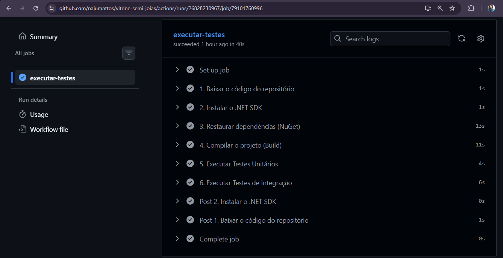
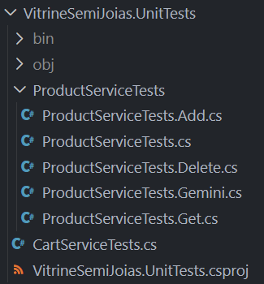
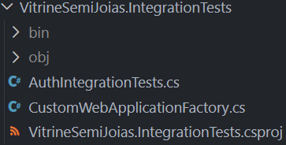
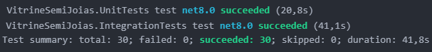
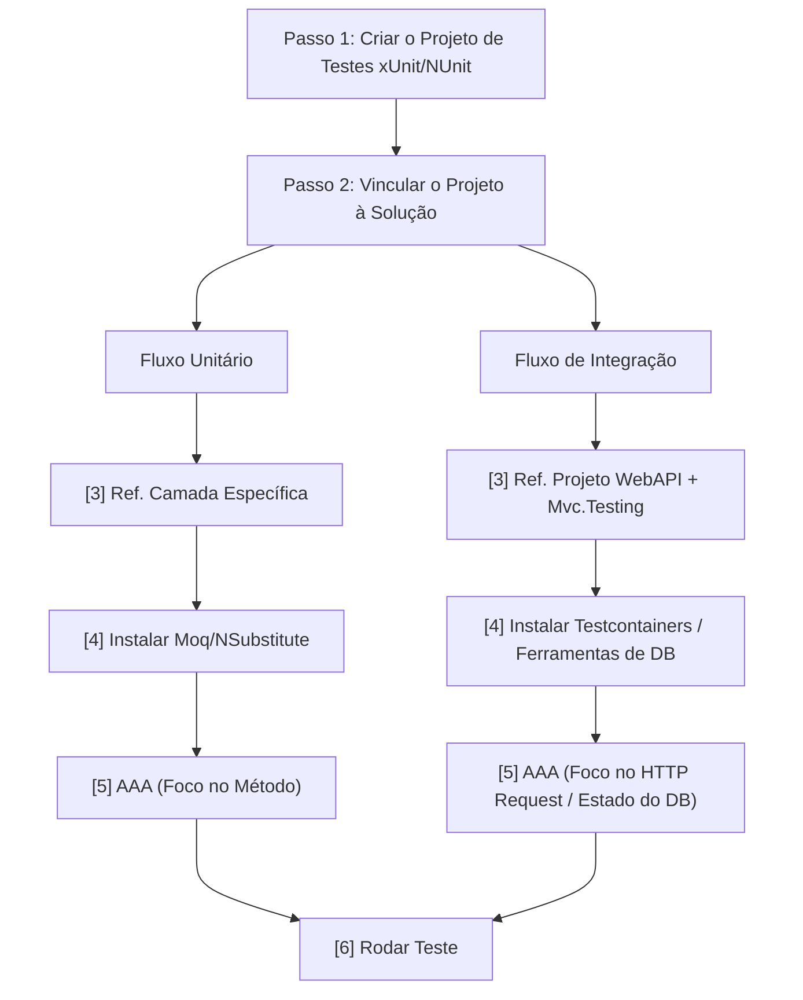

No desenvolvimento de software a velocidade de entrega não deve comprometer a estabilidade do sistema, é aqui que entra o conceito de CI/CD, que engloba a Continuous Integration (Integração Contínua) e o Continuous Delivery ou Continuous Deployment (Entrega ou Implantação Contínua).Trata-se de uma metodologia apoiada por automação que transforma o ciclo de vida do software, garantindo que o código saia da máquina do desenvolvedor e chegue ao ambiente de produção de forma rápida, segura e padronizada.

>💡 Este artigo focará exclusivamente nos pilares e na implementação do CI. No próximo, focaremos em CD-Continuous Deployment(Implantação Contínua). Todos os conceitos explicados a seguir foram validados em um ambiente real utilizando **.NET** [[Link do Projeto](https://github.com/najumattos/vitrine-semi-joias)].

## O que é CI e qual problema ele resolve?

O foco central da Integração Contínua é a frequência de integração e a validação automatizada. Em fluxos de trabalho antigos, desenvolvedores trabalhavam isolados em suas branches por semanas. O resultado era o previsível Merge Hell (Inferno do Merge): centenas de conflitos de código, falhas de comunicação entre componentes e bugs descobertos apenas em produção.

O CI resolve isso exigindo que a equipe integre suas alterações em um repositório central (geralmente as branches main ou develop) múltiplas vezes ao dia. Para que essa integração frequente não quebre o sistema, remove-se o fator humano da validação. Sempre que um desenvolvedor realiza um git push ou abre um Pull Request, um servidor de CI (como GitHub Actions, GitLab CI ou Azure Pipelines) intercepta o código e dispara uma esteira de automação.

Uma esteira (pipeline) de CI funciona como um portão de qualidade rigoroso, executando o seguinte fluxo sequencial e isolado:

- **1. Provisionamento e Checkout:** A esteira aloca uma máquina virtual limpa e executa o _Checkout_ (baixa o código do seu repositório para dentro dessa máquina).
- **2. Configuração do Ambiente:** Instala o **.NET SDK** na versão exata especificada no projeto. Sem isso, a máquina não possui os compiladores e ferramentas necessárias.
- **3. Restore (Restauração):** O comando `dotnet restore` é executado. O ambiente baixa todos os pacotes e dependências externas (como os pacotes NuGet) necessários para o projeto rodar.
- **4. Build (Compilação):** O sistema compila o código-fonte (`dotnet build`). Essa etapa garante de forma automatizada que não existem erros de sintaxe, referências perdidas ou quebras de contrato no código.
- **5. Execução dos Testes Unitários:** O motor de testes roda a suíte de testes unitários. É a validação rápida de algoritmos, regras de negócio e lógica isolada de métodos.
- **6. Execução dos Testes de Integração:** Roda a suíte de testes de integração, validando o comportamento de ponta a ponta, comunicação com banco de dados, requisições HTTP e controllers da API.


---
> ⚠️ **Regra de Ouro do CI:** A esteira funciona como um portão de qualidade. Se qualquer teste falhar ou a compilação quebrar, o processo é abortado imediatamente, o código é bloqueado e a equipe é alertada. O código defeituoso jamais avança para as próximas etapas (CD).

## 1. Testes Unitários (Unit Tests)



O foco do teste unitário é testar a **menor unidade isolada de código** possível. Geralmente, essa unidade é um método ou uma função específica de uma classe.
A regra principal aqui é o **isolamento absoluto**: o teste unitário não pode conversar com o banco de dados, não pode fazer chamadas de rede (APIs externas) e não pode depender do sistema de arquivos. Qualquer dependência externa é substituída por um objeto simulado (chamado de **Mock** ou **Stub**).

- **Analogia do carro:** É você tirar uma vela de ignição do motor, colocá-la em uma bancada de testes isolada e verificar se ela solta faísca quando recebe corrente elétrica. Você não quer saber se o motor liga; quer saber se _aquela peça específica_ funciona sozinha.

### Vantagens

- **Velocidade:** Como rodam totalmente em memória e sem comunicação externa, milhares de testes unitários podem ser executados em pouquíssimos segundos.
- **Precisão do erro:** Se o teste falhar, você sabe exatamente qual linha de código e qual regra de negócio quebrou.

### Estrutura do Teste Unitário

**O Padrão AAA (Arrange, Act, Assert)**

Para manter a manutenibilidade e a clareza visual dos testes, a indústria adota universalmente o **padrão AAA**. Ele divide o corpo do teste em três blocos lógicos bem definidos:

- **Arrange (Preparação):** Configura o ambiente. Aqui são instanciados os objetos, criados os dados de entrada e definidos os comportamentos dos Mocks.

- **Act (Ação):** O momento em que o método sob teste é efetivamente executado. Deve conter, preferencialmente, apenas uma linha de código.

- **Assert (Verificação):** Onde o resultado da ação é comparado com a expectativa. Se o resultado for diferente do esperado, o teste falha.

```csharp
[Fact]
public void AdicionarItem_ProdutoDisponivel_DeveIncrementarTotalDoCarrinho()
{
    // Arrange (Preparação do cenário)
    var carrinho = new Carrinho();
    var produtoValido = new Produto { Id = 1, Preco = 150.00m, IsAvailable = true };

    // Act (Execução da unidade)
    carrinho.AdicionarItem(produtoValido);

    // Assert (Validação do comportamento)
    Assert.Single(carrinho.Itens);
    Assert.Equal(150.00m, carrinho.ValorTotal);
}
``` 

## 2. Testes de Integração (Integration Tests)

O foco do teste de integração é validar se **duas ou mais unidades/componentes funcionam bem juntos**. Ele preenche a lacuna que o teste unitário deixa ao isolar tudo.
Aqui, os pontos de atrito são testados: a comunicação entre o código e o banco de dados real, a integração com uma API de pagamento, ou se duas classes de regras de negócio distintas conversam corretamente sem corromper os dados.

- **Analogia do carro:** É o momento de montar a vela no motor, conectar o tanque de combustível, girar a chave e ver se o motor dá a partida. As peças individuais podem estar perfeitas, mas se o cabo de combustível estiver entupido (falha na integração), o motor não vai funcionar.

### Vantagens

- **Fidelidade e Confiança Real:** Garante que o sistema funciona de ponta a ponta sob condições muito próximas às de produção. Ele valida se as queries LINQ/SQL são compatíveis com o banco de dados real.
- **Detecção de Falhas Ocultas:** Captura erros que testes unitários jamais pegariam, como falhas de configuração de strings de conexão, problemas de permissão em tabelas, desserialização incorreta de JSONs de APIs externas e quebras de contratos de rede.

### Estrutura do Teste de Integração



No .NET, a melhor prática para testar integração em APIs HTTP é utilizar o pacote Microsoft.AspNetCore.Mvc.Testing. Ele nos fornece a classe WebApplicationFactory<T>, que sobe toda a sua API e um servidor HTTP fictício em memória, permitindo testar a rota inteira (Controller, Services, Repositories e Banco de Dados) sem precisar rodar a aplicação manualmente.
Veja um teste que valida se o endpoint de criação de produto realmente persiste a informação no banco de dados:

```csharp
public class ProdutosControllerTests : IClassFixture<WebApplicationFactory<Program>>
{
    private readonly HttpClient _client;

    public ProdutosControllerTests(WebApplicationFactory<Program> factory)
    {
        // Cria o cliente HTTP configurado com o servidor em memória da API
        _client = factory.CreateClient();
    }

    [Fact]
    public async Task Post_AoCriarNovoProduto_DeveGravarNoBancoERetornarStatusCodeCreated()
    {
        // Arrange
        var novoProduto = new { Title = "Anel de Prata", Preco = 120.00m };
        var jsonContent = JsonContent.Create(novoProduto);

        // Act (Executa a requisição real passando pelas camadas da API)
        var resposta = await _client.PostAsync("/api/v1/produtos", jsonContent);

        // Assert
        Assert.Equal(HttpStatusCode.Created, resposta.StatusCode);
    }
}
```
## Comparativo

| Caracteristica | Testes Unitários                      | Testes de Integração                      |
| -------------- | -------------------------------------- | ------------------------------------------- |
| Escopo         | Uma única função, método ou classe | Fluxo entre múltiplos componentes/sistemas |
| Velocidade     | Extremamente rápidos (milissegundos)  | Mais lentos (dependem de I/O, rede, banco)  |
| Dependências  | Nenhuma (usa Mocks/Simulações)       | Reais (Banco de dados, arquivos, APIs)      |



## Como criar um projeto de testes em C#?



### Fluxo de Testes Unitários

* **Passo 1:** Criar o projeto xUnit
```bash
dotnet new xunit -o tests/MeuProjeto.Tests.Unit
```
* **Passo 2:** Adicionar o projeto à Solução
```bash
dotnet sln MeuProjeto.sln add tests/MeuProjeto.Tests.Unit/MeuProjeto.Tests.Unit.csproj
```
* **Passo 3:** Referenciar a camada de aplicação/core que será testada
```bash
dotnet add tests/MeuProjeto.Tests.Unit/MeuProjeto.Tests.Unit.csproj reference src/MeuProjeto.API/MeuProjeto.API.csproj
```
* **Passo 4:** Instalar o pacote de Mocks

  ```bash
  cd tests/MeuProjeto.Tests.Unit
  dotnet add package NSubstitute
  ```
* **Passo 5: Escrever o Primeiro Teste (Padrão AAA)
* **Passo 6**: Executar a suíte de testes `dotnet test`

### Fluxo de Testes de Integração

* **Passo 1:** Criar o projeto xUnit para integração
```bash
dotnet new xunit -o Tests/MeuProjeto.IntegrationTests
```
* **Passo 2:** Adicionar o projeto à Solução
```bash
dotnet sln MeuProjeto.sln add Tests/MeuProjeto.IntegrationTests/MeuProjeto.IntegrationTests.csproj
```
* **Passo 3:** Referenciar o projeto principal
```bash
dotnet add Tests/VitrineSemiJoias.IntegrationTests/MeuProjeto.IntegrationTests.csproj reference MeuProjeto/MeuProjeto.csproj
```
* **Passo 4:** Instalar as ferramentas de servidores em memória e banco de dados
  ```bash
  cd tests/MeuProjeto.Tests.IntegrationTests
  dotnet add package Microsoft.AspNetCore.Mvc.Testing
  dotnet add package Microsoft.EntityFrameworkCore.InMemory
  ```
* **Passo 5:** Escrever o teste de integração simulando as requisições HTTP na API
* **Passo 6**: Executar a suíte de testes `dotnet test`

## Como Configurar Pipeline de Testes Automatizados com Github Actions?
É nesse arquivo .yml que configuramos os passos de execução da esteira de CI, funciona como um portão de qualidade rigoroso, para executar o seguinte fluxo sequencial e isolado:
```bash
name: Pipeline de Testes Automatizados

# 1. Quando o GitHub deve rodar essa esteira?
on:
  push:
    branches: [ "main" ] # Roda ao fazer push nessa branch
  pull_request:
    branches: [ "main" ] # Roda quando criarem um Pull Request

# 2. O que a máquina do GitHub vai fazer?
jobs:
  executar-testes:
    runs-on: ubuntu-latest # Cria uma máquina virtual Linux zerada

    steps:
    - name: 1. Baixar o código do repositório
      uses: actions/checkout@v4

    - name: 2. Instalar o .NET SDK
      uses: actions/setup-dotnet@v4
      with:
        dotnet-version: '8.0' 

    - name: 3. Restaurar dependências (NuGet)
      run: dotnet restore

    - name: 4. Compilar o projeto (Build)
      run: dotnet build --no-restore

    # 🔥 Separando os testes para logs mais limpos na esteira:
    
    - name: 5. Executar Testes Unitários
      run: dotnet test Tests/VitrineSemiJoias.UnitTests/ --no-build --verbosity minimal

    - name: 6. Executar Testes de Integração
      run: dotnet test Tests/VitrineSemiJoias.IntegrationTests/ --no-build --verbosity normal
```

## Conclusão
A automação de processos por meio do CI e a robustez garantida pelas suítes de testes não são apenas ferramentas técnicas ou burocracias de desenvolvimento; são garantias que viabilizam a evolução sustentável de qualquer ecossistema de software.

Em meus projetos — como o que ilustra este artigo —, busco sempre ir além da simples escrita de código. Meu objetivo principal é dominar a arquitetura subjacente e o fluxo completo dos processos, compreendendo exatamente como cada componente se integra.

Acredito que a engenharia de software de excelência é um ciclo incremental. Compreender profundamente as fundações de um projeto atual, identificando seus pontos de atrito e gargalos arquiteturais, é o que garante o conhecimento necessário para projetar o próximo sistema com ainda mais maturidade, performance e qualidade de código.

---
Para acompanhar a evolução de meus projetos conheça meu github: [najumattos]

[najumattos]:https://github.com/najumattos/