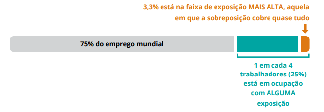

Em vez de perguntar se uma profissão inteira vai desaparecer, faz mais sentido perguntar **quais partes dela estão mudando, e de que forma** — porque ninguém exerce uma profissão inteira ao mesmo tempo; o que se exerce, todo dia, são competências específicas. Algumas ganham peso com a IA, outras mudam de forma, algumas nascem agora, e outras perdem espaço. Este resumo organiza essas quatro possibilidades e aplica cada uma delas ao contexto que mais me interessa: o que muda para quem está construindo carreira em desenvolvimento de software agora, com a IA já dentro da rotina de trabalho.

## Visões sobre IA e trabalho

Existem diferentes formas de enxergar os impactos da Inteligência Artificial no mercado de trabalho. Em vez de simplesmente perguntar se uma profissão vai desaparecer, o mais importante é compreender **como a IA está transformando as competências e tarefas que fazem parte de cada profissão**.

-   **Determinismo:** acredita que a tecnologia inevitavelmente substituirá profissionais.
-   **Negacionismo:** nega que a IA esteja provocando mudanças significativas.
-   **Leitura crítica:** reconhece as mudanças e procura entender **quais partes do trabalho estão sendo afetadas e de que maneira**.

Isso acontece porque **uma profissão não é uma atividade única**, mas um conjunto de diferentes competências e tarefas. A IA pode substituir, modificar ou complementar algumas delas, enquanto outras continuam sendo importantes.

Um dado ajuda a calibrar essa leitura crítica. A Organização Internacional do Trabalho mediu, ocupação por ocupação, o que chama de exposição à IA generativa — a sobreposição entre as tarefas de uma profissão e o que a tecnologia consegue executar. O resultado tem duas metades bem diferentes: **um em cada quatro trabalhadores no mundo** exerce uma ocupação em que ao menos parte das tarefas pode ser feita por IA, mas a faixa de exposição mais alta, aquela em que a sobreposição cobre quase tudo o que a ocupação faz, alcança só **3,3% do emprego mundial**. É essa diferença entre "afetado em parte" e "afetado por inteiro" que sustenta a leitura crítica: o efeito mais provável não é a substituição em massa, é a transformação das ocupações.

>Embora a IA esteja impactando o trabalho de muitas pessoas, isso não significa que todas as ocupações tenham alta exposição à IA. Uma ocupação pode ser significativamente transformada pela tecnologia mesmo que apenas parte de suas tarefas possa ser automatizada ou realizada com auxílio da IA.

## As quatro categorias de competências — Taxonomia EEED

A classificação foi proposta por **Bailey McOwen (2025)**, baseada na forma como as competências são afetadas pela automação e pela IA. São quatro categorias: **Enduring, Evolving, Emerging e Diminishing (EEED)**

|Categoria|Significado|Exemplos|
|--|--|--|
|🟢 **Enduring**|  Competências duradouras| Ética, pensamento sistêmico, responsabilidade|
|🔵 **Evolving**|Competências que mudam de forma|Resolução de problemas, análise de dados, programação|
|🟣 **Emerging**|Competências que surgem com a IA|Literacia em IA, auditoria de outputs, detecção de viés|
|🟠 **Diminishing**|Competências que perdem espaço|Cálculos rotineiros, buscas básicas, tarefas padronizadas|

1.  **Enduring — Duradoura** 🧠 **Exemplo: análise e tomada de decisões arquiteturais** A IA pode sugerir diferentes arquiteturas para um sistema, mas o desenvolvedor precisa entender os requisitos, restrições, segurança, escalabilidade e impactos de cada alternativa para decidir qual solução realmente faz sentido. Essa competência permanece importante porque envolve **julgamento e responsabilidade**.
    
2.  **Evolving — Em evolução** 💻 **Exemplo: depuração (debugging) de código** Antes, o desenvolvedor procurava manualmente os erros no código. Hoje, pode utilizar IA para identificar problemas e sugerir correções. Porém, ainda precisa analisar a sugestão, testar a solução e decidir se ela é adequada ao contexto do sistema. A competência continua existindo, mas **a forma de realizá-la mudou**.
    
3.  **Emerging — Emergente** 🤖 **Exemplo: auditoria de código gerado por IA** Com a popularização da IA generativa, tornou-se cada vez mais importante verificar se o código produzido por uma ferramenta é correto, seguro, eficiente, adequado ao contexto do sistema e livre de comportamentos inesperados. Essa competência se encaixa em **Emerging** porque a necessidade de auditar sistematicamente outputs gerados por IA ganhou importância justamente com a adoção dessas ferramentas.
    
4.  **Diminishing — Em declínio** ⌨️ **Exemplo: escrita manual de código boilerplate/repetitivo** A IA e outras ferramentas conseguem gerar rapidamente estruturas repetitivas, como classes, métodos CRUD e testes básicos. Com isso, diminui a necessidade de o desenvolvedor escrever manualmente todo esse código. Isso não significa que o desenvolvedor possa deixar de entender o código. O conhecimento continua necessário para **verificar se aquilo que foi gerado está correto**. Essa é justamente a ideia da categoria _Diminishing_: a execução manual perde espaço, mas a compreensão necessária para validar o resultado permanece importante.
    

Vale um aviso importante antes de seguir adiante: **a mesma competência pode cair em categorias diferentes conforme o modo como é praticada**. Escrever um relatório técnico é competência em evolução, porque a IA ajuda a redigir. Sustentar aquele relatório em uma reunião, quando alguém questiona um número, é competência duradoura. É a mesma pessoa, o mesmo documento, e duas categorias distintas — a taxonomia classifica o uso, não a atividade em abstrato.

## A IA pode aumentar a produtividade

Um experimento de **Brynjolfsson, Li e Raymond (2025)** mostra ganhos de produtividade com o uso de IA: o estudo acompanhou mais de **5 mil atendentes de suporte**, registrando um aumento médio de **14% na produtividade**, chegando a **34% entre os trabalhadores menos experientes**, enquanto entre os mais experientes o efeito foi mínimo. Os resultados indicam que a IA pode aumentar significativamente a produtividade, principalmente entre profissionais com menos experiência.

> **Reflexão — IA e as oportunidades para juniores**
> 
> No mercado de desenvolvimento de software, esse mesmo aumento de produtividade pode representar um desafio para quem está começando. Se a IA automatiza tarefas que tradicionalmente eram de juniores, as empresas podem reduzir a necessidade de contratar para essas funções e buscar desenvolvedores mais experientes, capazes de produzir mais com o apoio da IA. Isso cria um paradoxo: a IA pode ajudar o júnior a produzir mais, mas também pode reduzir justamente as oportunidades pelas quais ele adquiriria experiência. Dito isso, eu preciso de um emprego.
> 
> Mas é justamente por isso que a resposta não pode ser competir com a IA naquilo que ela faz melhor — executar tarefas repetitivas rapidamente. O caminho é usá-la para acelerar o próprio desenvolvimento, enquanto se fortalecem os fundamentos, a resolução de problemas e o entendimento dos sistemas que se está construindo. O profissional que aprende a trabalhar com a IA transforma a própria ferramenta que ameaça seu espaço em um acelerador de experiência. Mas essa mesma velocidade tem um custo: quem ainda está construindo conhecimento consegue produzir mais rápido, porém também tem mais dificuldade de perceber quando a resposta está errada.

Por isso, **produtividade e capacidade de auditoria precisam crescer juntas**, compensando o déficit cognitivo e técnico que essa mesma velocidade pode produzir.[[Link](https://github.com/najumattos/)].

## O conhecimento continua sendo importante

Essa capacidade de auditoria não nasce sozinha — ela depende diretamente do quanto o profissional domina os fundamentos da própria área. Uma resposta da IA pode ser bem estruturada, coerente e parecer correta, e ainda assim estar errada. Só quem tem conhecimento técnico consegue identificar erros, dados desatualizados, vieses e situações em que a solução apresentada simplesmente não se aplica ao problema.

No desenvolvimento de software, isso significa continuar aprendendo programação, lógica, estruturas de dados, banco de dados e os outros fundamentos da área, enquanto se usa a IA para auxiliar na criação, explicação, depuração e revisão de código. **O objetivo não é competir com a IA na velocidade de escrever código, mas entender o suficiente para avaliar, corrigir e tomar decisões sobre aquilo que ela produz.**

## Ética passa a ser ainda mais importante

Só que auditar tecnicamente não é suficiente. A IA pode **executar uma tarefa corretamente do ponto de vista técnico, mas isso não significa que a decisão tomada seja necessariamente correta do ponto de vista ético**. Com a automação, o profissional precisa avaliar não apenas se o sistema funciona, mas também quais são as consequências do seu uso — não basta perguntar "a IA está funcionando?"; é preciso perguntar também "ela está funcionando de maneira justa e adequada?". Isso envolve considerar vieses nos dados, impactos sociais, transparência e as consequências de decisões automatizadas.

No desenvolvimento de software, por exemplo, um sistema pode funcionar exatamente como foi programado e ainda assim produzir resultados problemáticos. Por isso, o desenvolvedor precisa de conhecimento técnico _e_ ético para identificar quando o problema não está no funcionamento do algoritmo, mas **na própria decisão de como ele foi desenvolvido, treinado ou utilizado**.

Se o conhecimento técnico é o que sustenta a auditoria, a ética é o que define seus critérios: o **raciocínio ético é uma competência duradoura (enduring)**, enquanto a **detecção de viés e a ética aplicada à IA** são competências emergentes — a primeira fornece os critérios para julgar o que é adequado; a segunda, os procedimentos para identificar problemas nos sistemas de IA.

## Novas competências para trabalhar com IA

São quatro competências que fazem parte das chamadas **competências emergentes** (_emerging_), uma das quatro categorias da taxonomia de Bailey McOwen. Elas ganham centralidade no mercado justamente porque a Inteligência Artificial passou a existir, exigindo novas habilidades práticas que antes não faziam parte das rotinas profissionais:

1.  **🤖 Literacia em IA** Consiste em **compreender o funcionamento, a construção, os limites e a adequação do uso** de diferentes sistemas de Inteligência Artificial.

-   **Plausível vs. Verdadeiro:** o primeiro degrau dessa competência é reconhecer que modelos de linguagem produzem textos estatisticamente plausíveis, o que é fundamentalmente diferente de produzir textos verdadeiros.
-   **Níveis de Profundidade:** baseia-se no referencial da UNESCO (2024), que divide o conhecimento necessário para os estudantes em três níveis de profundidade: **compreender, aplicar e criar**.
-   **A Pergunta Certa:** ter literacia significa saber formular perguntas complexas que o modelo tem dificuldade de responder. Enquanto o treinamento do sistema cabe a quem o constrói, a formulação da pergunta certa é responsabilidade sua.

2.  **🤝 Colaboração humano-IA** Envolve a capacidade prática de trabalhar em conjunto com a máquina de forma eficiente e segura, dividindo tarefas e validando os resultados.

-   **Auditoria de Output:** é o ato de avaliar e auditar criticamente o resultado entregue pela ferramenta (seja um código ou uma projeção de mercado), encontrando a premissa da qual a resposta depende para ser verdadeira e conferindo-a em fontes independentes. Isso evita que você repasse adiante erros plausíveis de forma automatizada.
-   **Engenharia de Contexto:** refere-se à habilidade de **estruturar um problema** para que a IA contribua de maneira útil. Isso se materializa na construção de prompts precisos que definem o papel do sistema, as restrições e o formato esperado da resposta — na prática, é a diferença entre pedir "crie uma API para cadastro de usuários" e especificar linguagem, framework, banco de dados, regras de validação e formato de resposta. Quanto mais estruturado o problema, mais fácil também é avaliar a resposta.
-   **Modelos de Trabalho:** envolve a adoção de dinâmicas estruturadas de colaboração, como os métodos **Centauro** (divisão clara de tarefas entre humano e máquina) e **Ciborgue** (integração contínua e intercalada do trabalho humano com a IA).

3.  **🔎 Detecção de viés** Enquanto o raciocínio ético tradicional (competência duradoura) oferece o critério moral, a detecção de viés fornece o **procedimento técnico** para identificar e mitigar preconceitos em sistemas automatizados.

-   **Análise de Desvio:** significa identificar quando um algoritmo apresenta uma tendência sistemática de errar mais para um grupo específico ou em uma situação do que em outros.
-   **Avaliação de Transparência:** exige que o profissional analise criticamente a composição dos dados que treinaram a máquina e meça o desempenho de forma segmentada (por exemplo, por recortes sociais ou demográficos), em vez de aceitar apenas a média geral de precisão do sistema.

4.  **📖 Aprendizado contínuo** O aprendizado contínuo é tratado na taxonomia como uma **competência técnica e metodológica**, e não como um traço de personalidade.
 
-   **Método de Atualização:** trata-se de construir um método pessoal para atualizar o repertório profissional em uma velocidade superior à que qualquer currículo acadêmico tradicional consegue acompanhar.
-   **Saber Aprender:** diante da rapidez com que as ferramentas tecnológicas de hoje se tornam obsoletas, a habilidade mais durável que um profissional pode desenvolver é a capacidade de aprender novos conceitos.

## Conclusão

Quanto mais a IA assume tarefas de execução, mais valor ganham as competências relacionadas a conhecimento, julgamento, responsabilidade, ética, criatividade, adaptação e capacidade de avaliar os resultados da própria IA.

## Referências
* **PLACCA, José Avelino.**  _Competências Profissionais na Era da IA: o que fica, o que muda, o que surge_. São Paulo: Univesp, 2026. 19 p. (Série IA na Prática Acadêmica e Profissional, Quinzena 3, Módulo 1)
* **BRYNJOLFSSON, E.; LI, D.; RAYMOND, L.**  _Generative AI at Work_. _The Quarterly Journal of Economics_, v. 140, n. 2, p. 889-942, 2025
* **McOWEN, Bailey.**  _Engineering Competency Evolution in the AI Era_. In: KATZ, A.; KIM, D. et al. (org.). _Integrating Artificial Intelligence into Engineering Education_. Workshop. São Paulo: USP, setembro de 2025
* **ORGANIZAÇÃO INTERNACIONAL DO TRABALHO (OIT).**  _Generative AI and Jobs: a refined global index of occupational exposure_. ILO Working Paper 140. Genebra: OIT, 2025
* **UNESCO.**  _AI competency framework for students_. Paris: UNESCO, 2024

